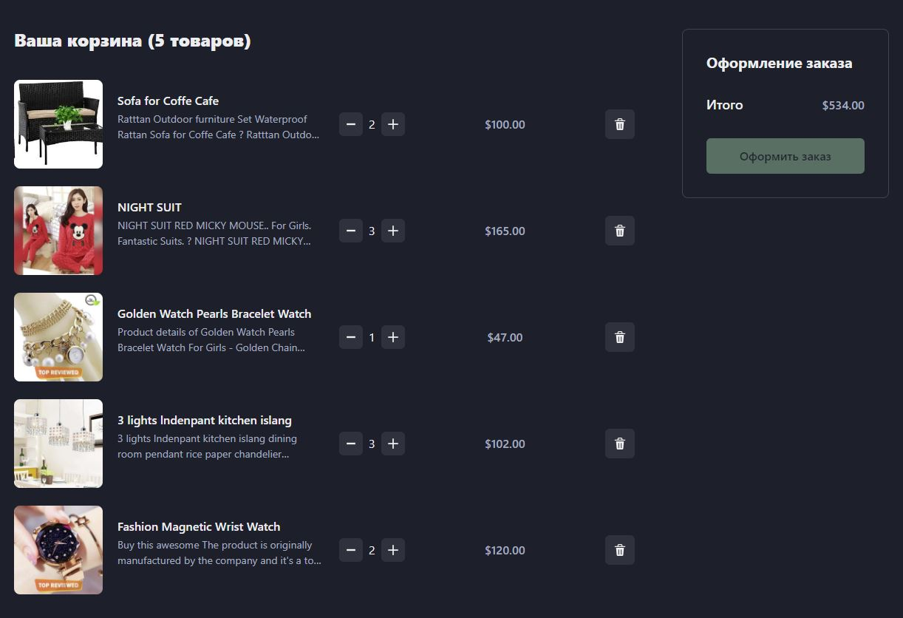

# Shopping cart - one-page app

This is a mini-app that acts as a shopping cart, created using the Feature Sliced Design methodology. The cart is divided into two columns with a 3:1 width ratio. A random shopping cart of products is loaded from a Dummy JSON API, allowing users to delete products and modify their quantities.

## Table of contents

- [Overview](#overview)
  - [The challenge](#the-challenge)
  - [Screenshot](#screenshot)
  - [Links](#links)
  - [How to install](#how-to-install)
- [My process](#my-process)
  - [Built with](#built-with)

## Overview

### The challenge

Users should be able to:

- Retrieve a shopping cart from an external API
- Remove products from the cart
- Change the quantity of products

### Screenshot



### Links

- Solution URL: [github.com/alexbulgakov/shopping-cart](https://github.com/alexbulgakov/shopping-cart)
- Live Site URL: [shopping-cart-lake-psi.vercel.app](https://shopping-cart-lake-psi.vercel.app/)

### How to install

For local installation, you need to run the following command in the terminal of the project directory:

```bash
npm install
```

To start in development mode, you need to run the command:

```bash
npm run dev
```

## My process

### Built with

- [Chakra UI](https://chakra-ui.com/)
- [React](https://reactjs.org/)
- [TypeScript](https://www.typescriptlang.org/)
- [Feature Sliced Design](https://feature-sliced.design/) - Architectural methodology for frontend projects
- [Redux Toolkit](https://redux-toolkit.js.org/) - Toolset for efficient Redux development
- [Dummy JSON](https://dummyjson.com/)
